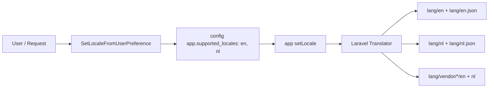

# Requirements

### Overview & Goals
The objective of this task is to simplify and standardize the application's locale naming conventions by renaming all `en_US` files/folders to `en` and all `nl_BE` files/folders to `nl`. This includes translation files, vendor override folders, application configs, database migrations, model defaults, factories, Filament panel components, test suites, and documentation.

### Scope
#### In Scope
- Renaming root translation directories: `lang/en_US` -> `lang/en`, `lang/nl_BE` -> `lang/nl`.
- Renaming root JSON translation files: `lang/en_US.json` -> `lang/en.json`, `lang/nl_BE.json` -> `lang/nl.json`.
- Renaming all vendor translation subdirectories under `lang/vendor/*/en_US` -> `lang/vendor/*/en` and `lang/vendor/*/nl_BE` -> `lang/vendor/*/nl`.
- Updating application configuration (`config/app.php` and `.env.example`).
- Updating database migration defaults, model defaults, and factories (`users` table, `User` model, `Tag` model, `UserFactory`, `TagFactory`).
- Updating Filament locale switching actions in `AdminPanelProvider` and upload placeholder conditions in schema components.
- Updating test cases in `tests/` that reference `en_US` and `nl_BE`.
- Updating documentation in `FILAMENT.md`.

#### Out of Scope
- Adding new translations or modifying translation message strings (other than standardizing locale keys).
- Changing Faker locale (`APP_FAKER_LOCALE` / Faker generator configurations) unless required for test consistency.

### User Stories
- **As an admin user**, I want to switch between English (`en`) and Dutch (`nl`) using the Filament user menu so that the interface is rendered in my preferred language.
- **As a developer**, I want standard two-letter ISO 639-1 locale codes (`en`, `nl`) across the entire repository to ensure consistent paths, cleaner config, and standard Laravel localization behavior.

### Functional Requirements
1. The application's default locale must be `nl` and the fallback locale must be `en`.
2. Supported locales in `config/app.php` must be `['en', 'nl']`.
3. The Filament locale switcher must allow toggling between English (`en`) and Nederlands (`nl`).
4. All translatable models (such as `Tag`) and user profile preferences must store and retrieve translations using `en` and `nl` locale codes.
5. All translation files in `lang/` and `lang/vendor/` must resolve properly when `app()->setLocale('en')` or `app()->setLocale('nl')` is called.

# Technical Design

### Current Implementation
The application currently uses `nl_BE` as the primary Dutch/Belgian locale and `en_US` as the fallback English locale across:
- `lang/en_US/` and `lang/nl_BE/` directories containing PHP translation files.
- `lang/en_US.json` and `lang/nl_BE.json` translation files.
- `lang/vendor/{package}/en_US` and `lang/vendor/{package}/nl_BE` vendor overrides for 15 packages (including `backup`, `cookie-consent`, `health`, and various `filament-*` packages).
- `config/app.php` configured with `'locale' => 'nl_BE'`, `'fallback_locale' => 'en_US'`, and `'supported_locales' => ['en_US', 'nl_BE']`.
- `app/Models/User.php` and migration default `'locale' => 'nl_BE'`.
- `app/Models/Tag.php` returning `nl_BE` for `getLocale()` and `en_US` for `getFallbackLocale()`.
- `app/Providers/Filament/AdminPanelProvider.php` registering `locale-en_US` and `locale-nl_BE` menu actions.
- Schema components checking `str_replace('-', '_', app()->getLocale()) === 'nl_BE'`.

### Key Decisions
- **Standardize on two-letter locale codes (`en` and `nl`)**: Aligns with Laravel defaults and simplified localization structures.
- **Rename all vendor override subfolders**: Ensure all Filament and third-party vendor overrides under `lang/vendor/` match the updated two-letter codes so translations continue to resolve.

### Proposed Changes

#### 1. File and Directory Renaming Mapping
- `lang/en_US` -> `lang/en`
- `lang/nl_BE` -> `lang/nl`
- `lang/en_US.json` -> `lang/en.json`
- `lang/nl_BE.json` -> `lang/nl.json`
- `lang/vendor/backup/en_US` -> `lang/vendor/backup/en`
- `lang/vendor/backup/nl_BE` -> `lang/vendor/backup/nl`
- `lang/vendor/cookie-consent/en_US` -> `lang/vendor/cookie-consent/en`
- `lang/vendor/cookie-consent/nl_BE` -> `lang/vendor/cookie-consent/nl`
- `lang/vendor/filament/en_US` -> `lang/vendor/filament/en`
- `lang/vendor/filament/nl_BE` -> `lang/vendor/filament/nl`
- `lang/vendor/filament-actions/en_US` -> `lang/vendor/filament-actions/en`
- `lang/vendor/filament-actions/nl_BE` -> `lang/vendor/filament-actions/nl`
- `lang/vendor/filament-forms/en_US` -> `lang/vendor/filament-forms/en`
- `lang/vendor/filament-forms/nl_BE` -> `lang/vendor/filament-forms/nl`
- `lang/vendor/filament-infolists/en_US` -> `lang/vendor/filament-infolists/en`
- `lang/vendor/filament-infolists/nl_BE` -> `lang/vendor/filament-infolists/nl`
- `lang/vendor/filament-notifications/en_US` -> `lang/vendor/filament-notifications/en`
- `lang/vendor/filament-notifications/nl_BE` -> `lang/vendor/filament-notifications/nl`
- `lang/vendor/filament-panels/en_US` -> `lang/vendor/filament-panels/en`
- `lang/vendor/filament-panels/nl_BE` -> `lang/vendor/filament-panels/nl`
- `lang/vendor/filament-query-builder/en_US` -> `lang/vendor/filament-query-builder/en`
- `lang/vendor/filament-query-builder/nl_BE` -> `lang/vendor/filament-query-builder/nl`
- `lang/vendor/filament-schemas/en_US` -> `lang/vendor/filament-schemas/en`
- `lang/vendor/filament-schemas/nl_BE` -> `lang/vendor/filament-schemas/nl`
- `lang/vendor/filament-spatie-backup/en_US` -> `lang/vendor/filament-spatie-backup/en`
- `lang/vendor/filament-spatie-backup/nl_BE` -> `lang/vendor/filament-spatie-backup/nl`
- `lang/vendor/filament-spatie-laravel-settings-plugin/en_US` -> `lang/vendor/filament-spatie-laravel-settings-plugin/en`
- `lang/vendor/filament-spatie-laravel-settings-plugin/nl_BE` -> `lang/vendor/filament-spatie-laravel-settings-plugin/nl`
- `lang/vendor/filament-tables/en_US` -> `lang/vendor/filament-tables/en`
- `lang/vendor/filament-tables/nl_BE` -> `lang/vendor/filament-tables/nl`
- `lang/vendor/filament-widgets/en_US` -> `lang/vendor/filament-widgets/en`
- `lang/vendor/filament-widgets/nl_BE` -> `lang/vendor/filament-widgets/nl`
- `lang/vendor/health/en_US` -> `lang/vendor/health/en`
- `lang/vendor/health/nl_BE` -> `lang/vendor/health/nl`

#### 2. Configuration & Environment Updates
- **`config/app.php`**:
  - `'locale' => env('APP_LOCALE', 'nl')`
  - `'fallback_locale' => env('APP_FALLBACK_LOCALE', 'en')`
  - `'supported_locales' => ['en', 'nl']`
- **`.env.example`**:
  - `APP_LOCALE=nl`
  - `APP_FALLBACK_LOCALE=en`

#### 3. Application Code Updates
- **`app/Models/User.php`**: Update default attribute `'locale' => 'nl'`.
- **`database/migrations/0001_01_01_000000_create_users_table.php`**: Default `'locale'` to `'nl'`.
- **`database/factories/UserFactory.php`**: Default `'locale'` to `'nl'`.
- **`app/Models/Tag.php`**:
  - `getLocale()` returns `'nl'`
  - `getFallbackLocale()` returns `'en'`
- **`database/factories/TagFactory.php`**: Update translations generator array to `['nl', 'en']`.
- **`app/Providers/Filament/AdminPanelProvider.php`**:
  - Replace `'locale-en_US'` with `'locale-en'` (`url` passing `'locale' => 'en'`).
  - Replace `'locale-nl_BE'` with `'locale-nl'` (`url` passing `'locale' => 'nl'`).
- **`app/Filament/Resources/Users/Schemas/Components/AvatarUpload.php`**, **`CoverImageUpload.php`**, **`ImageUploadSection.php`**:
  - Update `app()->getLocale() === 'nl'` (or normalized check).

#### 4. Documentation Updates
- **`FILAMENT.md`**: Update translation documentation referencing `en` and `nl`.

### Architecture Flow

### Risks & Mitigations
- **Broken test assertions referencing old locale codes**: Update all tests in `tests/` simultaneously to check for `en` / `nl` and verify with `vendor/bin/pest`.
- **Cache / compiled translations during development**: Clear cached views and configs during verification.

# Testing

### Validation Approach
Verification will be executed using automated feature and unit tests with Pest PHP, verifying both locale file structures and runtime behavior.

### Key Scenarios
1. **Translation File Integrity**: `tests/Unit/TranslationsTest.php` must verify that `lang/en.json`, `lang/nl.json`, `lang/en/`, `lang/nl/`, and all vendor subfolders exist and are valid JSON/PHP files.
2. **Locale Switching**: `tests/Feature/app/Filament/LocaleSwitcherTest.php` and `tests/Feature/app/Http/Controllers/Filament/LocaleControllerTest.php` must verify switching between `en` and `nl` updates the user's preferred locale and redirects back.
3. **Model & Factory Defaults**: `tests/Unit/app/Models/UserTest.php` and `tests/Unit/app/Models/TagTest.php` must verify that the default locale is `nl` and fallback locale is `en`.
4. **Tag Translatable Fields**: `tests/Feature/app/Filament/Resources/TagResourceTest.php` must verify tags create and update translations in `name->nl` and `name->en`.

### Test Changes
- **`tests/Unit/TranslationsTest.php`**: Update path assertions for `lang/en.json`, `lang/nl.json`, `['en', 'nl']` locales, and vendor directory paths.
- **`tests/Feature/app/Filament/LocaleSwitcherTest.php`**: Assert `locale-en` and `locale-nl` user menu actions and translation switches.
- **`tests/Feature/app/Http/Controllers/Filament/LocaleControllerTest.php`**: Assert valid locales `['en', 'nl']` return redirect 302 and unsupported locales return 404.
- **`tests/Feature/app/Filament/Resources/TagResourceTest.php`**: Update database assertions from `name->nl_BE` to `name->nl`.
- **`tests/Unit/app/Models/UserTest.php`**: Update assertions from `nl_BE` / `en_US` to `nl` / `en`.
- **`tests/Unit/app/Models/TagTest.php`**: Update locale method assertions (`getLocale() === 'nl'`, `getFallbackLocale() === 'en'`).
- **`tests/Unit/app/Filament/Traits/FormatsModelTypeTest.php`**, **`HasSettingsPageDefaultsTest.php`**, **`BackupPageTest.php`**, **`ProfilePageTest.php`**, **`AdminPanelProviderTest.php`**, **`SetLocaleFromUserPreferenceTest.php`**: Update `app()->setLocale()` calls from `en_US` / `nl_BE` to `en` / `nl`.

# Delivery Steps

###   Step 1: Rename language directories and JSON files in lang/ and lang/vendor/
All language directories and JSON files in `lang/` and `lang/vendor/` are renamed from `en_US`/`nl_BE` to `en`/`nl`.

- Rename `lang/en_US/` to `lang/en/` and `lang/nl_BE/` to `lang/nl/`.
- Rename `lang/en_US.json` to `lang/en.json` and `lang/nl_BE.json` to `lang/nl.json`.
- Rename all 15 vendor language subdirectories under `lang/vendor/*/en_US/` to `lang/vendor/*/en/` (including `backup`, `cookie-consent`, `health`, and all `filament-*` packages).
- Rename all 15 vendor language subdirectories under `lang/vendor/*/nl_BE/` to `lang/vendor/*/nl/` (including `backup`, `cookie-consent`, `health`, and all `filament-*` packages).

###   Step 2: Update application configuration, environment settings, and documentation
Core application configuration, environment variables, and docs are updated to use `en` and `nl` as the standard locales.

- Update `config/app.php`: set default `locale` to `nl`, `fallback_locale` to `en`, and `supported_locales` to `['en', 'nl']`.
- Update `.env.example`: set `APP_LOCALE=nl` and `APP_FALLBACK_LOCALE=en`.
- Update `FILAMENT.md`: replace references to `en_US` and `nl_BE` with `en` and `nl` in the translations section.

###   Step 3: Update models, migrations, factories, and Filament UI components
Application models, database migrations, factories, middleware, and Filament components are updated to use `en` and `nl`.

- Update `database/migrations/0001_01_01_000000_create_users_table.php` default locale from `nl_BE` to `nl`.
- Update `app/Models/User.php` attribute defaults from `nl_BE` to `nl`.
- Update `database/factories/UserFactory.php` default `locale` to `nl`.
- Update `app/Models/Tag.php`: update `getLocale()` to return `nl` and `getFallbackLocale()` to return `en`.
- Update `database/factories/TagFactory.php`: update translation array keys to `['nl', 'en']`.
- Update `app/Providers/Filament/AdminPanelProvider.php`: update locale switcher action IDs (`locale-en`, `locale-nl`), active check logic (`app()->getLocale() === 'en'` / `'nl'`), and route parameters.
- Update `app/Filament/Resources/Users/Schemas/Components/AvatarUpload.php`, `CoverImageUpload.php`, and `ImageUploadSection.php`: update placeholder locale checks to match `nl`.

###   Step 4: Update test suite and verify test execution
All unit and feature tests are updated to assert against `en` and `nl` locales and the full test suite passes.

- Update `tests/Unit/TranslationsTest.php`: update paths (`lang/en.json`, `lang/nl.json`), tested locale lists (`['en', 'nl']`), and vendor directory assertions.
- Update `tests/Feature/app/Filament/LocaleSwitcherTest.php`: test switching to `en` and `nl` with updated user menu assertions and status code checks.
- Update `tests/Feature/app/Http/Controllers/Filament/LocaleControllerTest.php`: test valid locales `en` and `nl` and invalid locale rejection.
- Update `tests/Unit/app/Models/UserTest.php`, `tests/Unit/app/Models/TagTest.php`, `tests/Feature/app/Filament/Resources/TagResourceTest.php`, and other related test files (`BackupPageTest.php`, `ProfilePageTest.php`, `FormatsModelTypeTest.php`, `HasSettingsPageDefaultsTest.php`, `SetLocaleFromUserPreferenceTest.php`, `AdminPanelProviderTest.php`).
- Run `vendor/bin/pest` to verify all tests pass.
- Run `vendor/bin/pint --dirty --format agent` to ensure code style compliance.